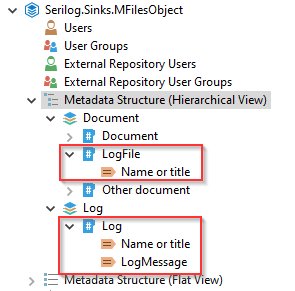
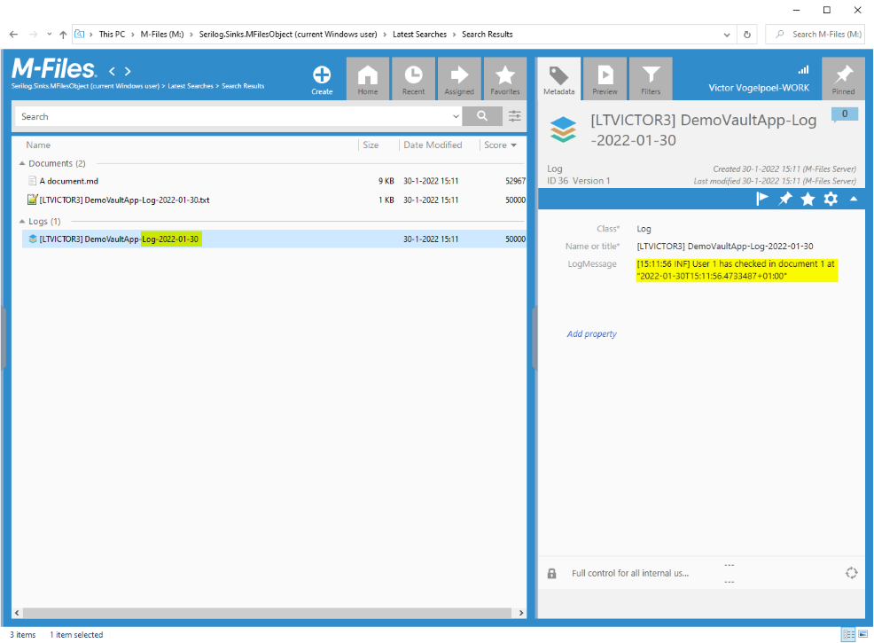
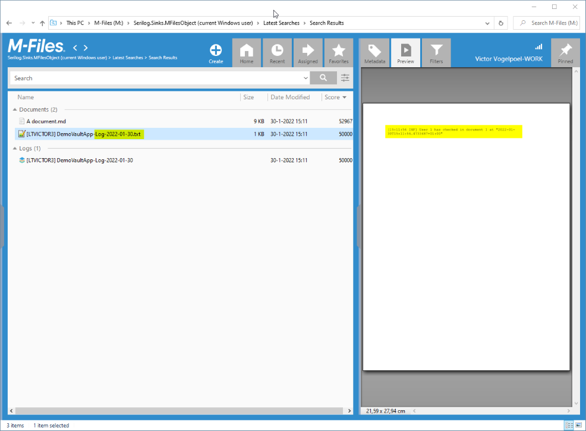
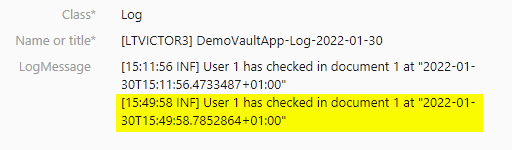
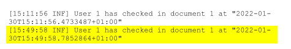

# Serilog.Sinks.MFilesObject<!-- omit in toc -->

`Serilog.Sinks.MFilesObject` is a Serilog structured logging sink that emits event messages to a "rolling" Log object or Log file in an M-Files vault using M-Files COM API.

*"M-Files is the intelligent document management system. With M-Files, organizations organize all their documents and information so that they can easily find, manage and secure them. M-Files is the smartest DMS you’ve ever seen."*

Use Serilog structured logging in your M-Files console, integration and vault application solutions and see your logging appear in the vault as an Log object or Log document. And just open the M-Files desktop app and inspect the logging of your application.

You can find the NuGet package here: See https://www.nuget.org/packages/Serilog.Sinks.MFilesObject/

[](https://github.com/victorvogelpoel/Serilog.Sinks.MFilesObject/actions/workflows/Build%20on%20push.yml)

[](https://github.com/victorvogelpoel/Serilog.Sinks.MFilesObject/actions)

## Contents<!-- omit in toc -->
- [Why would you use Serilog.Sinks.MFilesObject?](#why-would-you-use-serilogsinksmfilesobject)
- [Features](#features)
  - [Logging Metadata structure](#logging-metadata-structure)
  - [Demo Vault Application](#demo-vault-application)
- [Built with](#built-with)
- [Getting started with Serilog.Sinks.MFilesObject](#getting-started-with-serilogsinksmfilesobject)
  - [Prerequisites](#prerequisites)
- [Getting Serilog.Sinks.MFilesObject samples to work](#getting-serilogsinksmfilesobject-samples-to-work)
  - [Running the Demo vault application](#running-the-demo-vault-application)
  - [Running the Demo LogToVault Console application](#running-the-demo-logtovault-console-application)
- [How to use it](#how-to-use-it)
  - [Adding Serilog.Sinks.MFilesObject to your console or integration solution](#adding-serilogsinksmfilesobject-to-your-console-or-integration-solution)
  - [Adding Serilog.Sinks.MFilesObject to your M-Files vault application](#adding-serilogsinksmfilesobject-to-your-m-files-vault-application)
- [Contributing to Serilog.Sinks.MFilesObject](#contributing-to-serilogsinksmfilesobject)
- [Give back](#give-back)
- [Other related projects](#other-related-projects)
- [Contact information](#contact-information)
- [Acknowledgements](#acknowledgements)
- [License](#license)

## Why would you use Serilog.Sinks.MFilesObject?

I stumbled upon a specific lack in the M-Files application ecosystem when I was working on an vault application that was running against an M-Files cloud vault: I couldn't easily see the logging from my vault application, other than submitting a support request to the M-File cloud team to please forward me logging entries from the eventlog of the cloud server and receiving this hours or longer after the request... And the vault application developer guidance even explicitly states that the developer is not to log to the event log of a cloud vault server, so we're not even supposed to use that.

> In case you're are wondering: an M-Files Vault Application is a .NET 4.5 C# application that runs (out-of-process) with an M-Files Vault en reacts to events in the vault, like when creating, checking out or checking in a document or object. Currently, the only officially supported logging method is emitting log events to the Windows event log. It's easy to access these if you have access to the Windows server, but you don't have access to the event log of the Windows server for a *cloud* vault.

As I was already using Serilog structured logging, *I thought how about a Serilog sink that emits events to be stored in the vault itself*, surpassing a support request? This is why I started working on `Serilog.Sinks.MFilesObject`.
 
> **This sink collects log event messages in your solution and stores (appends) the batched messages every so seconds as a Log object, or Log document in the vault itself, and can easily be viewed using the M-Files Desktop app. Now the feedback loop between something happening in the vault application and seeing the logging of what happened is MUCH stronger.**


Now usage of the `Serilog.Sinks.MFilesObject` sink not limited to an M-Files vault applications, and can also be employed with an M-Files console or  integration solutions (as long as the solution uses the M-Files COM API).

In other words: `Serilog` helps you to do proper structured logging in your application and `Serilog.Sinks.MFilesObject` helps you to direct the log event messages to be stored in the vault and view these using the M-Files desktop client.

Important: I advise you to sparingly engage `Serilog.Sinks.MFilesObject`, for example when you are on a *troubleshooting* mission in your vault application in production and not have it 'on' all the time, as all-time logging may really flood the vault; and: each Log message and Log document counts in the purchased volume subscription!

The [Demo Vault Application](tree/master/src/DemoVaultApplication) has a sample VaultApp configuration where you can switch logging on or off. Its demo use case is to log when the user checks in an object.

## Features

- Using Serilog structured logging in an M-Files console, integration or vault application solution. See https://serilog.net and its github project https://github.com/serilog for more information about structured logging and serilog.
- Log to a 'rolling' multiline text property of a Log object in the M-Files vault with the `Serilog.Sinks.MFilesLogObjectMessage` sink.
- Log to a 'rolling' multiline document file in the M-Files vault with the `Serilog.Sinks.MFilesLogFile` sink.
- Separating the logging concern from use-case code: use case code can now be tested without even a sink configured. A Serilog Log statement without any sinks configured does not output anything.

'Rolling' means that the two sinks know how to deal with overflows:

- the `Serilog.Sinks.MFilesLogObjectMessage` sink creates a "`Log`" object in the vault with *the current date* in its NameOrTitle property, eg "`Log-2022-01-30`".
  - log messages are appended to its "`LogMessage`" property field until *its max contents of 10.000 characters* is reached; the sink will then create *another* "`Log`" object in the vault with an ordinal, eg "`Log-2022-01-30 (2)`" and start appending to this "`LogMessage`" property field.
  - If any error occurs when accessing the Log object, the sink creates a new Log object with the next ordinal, eg eg "`Log-2022-01-30 (3)`".
  - When the day rolls over to the next day, the sink will automatically create a new "`Log`" object in the vault with *the new date* in its NameOrTitle property, eg "`Log-2022-02-01`".
- The `Serilog.Sinks.MFilesLogFile` creates a new document text file of class "`LogFile`" in the vault with *the current date* in its NameOrTitle property, eg "`Log-2022-01-30.txt`".
  - Log messages are appended to its text file contents (no limit).
  - If any error occurs when accessing the Log document, the sink creates a new Log document and saves the log message.
  - When the day rolls over to the next day, the sink will automatically create a new document text file of class "`LogFile`" in the vault with *the new date* in its NameOrTitle property, eg "`Log-2022-02-01.txt`"

### Logging Metadata structure

The two sinks require metadata structure in the vault. Default it is:



The sinks use M-Files *aliases* to find the objecttypes, classes and properties; you could use other names for the metadata structure, but do keep the aliases!


### Demo Vault Application

Now how does the logging through the two sinks look like? The Demo Vault Application has a very simple use case: "Log when the user checks in a document or object in the vault.".

```csharp
this.Log.Information("User {User} has checked in document {DisplayID} at {TimeStamp}", env.CurrentUserID, env.DisplayID, DateTime.Now);
```

The two sinks have already been configured at Vault Application startup ([see the demo vault application code](tree/master/src/DemoVaultApplication)).

This is how you see the logging in the M-Files desktop client; the highlighted parts show the Log object "`[LTVICTOR3] DemoVaultApp-Log-2022-01-30`" with date and the Information message with interpolated strings in the `LogMessage` property.

[](./assets/screenshot-mfilesdesktop-logobject.png)

The LogFile document "`[LTVICTOR3] DemoVaultApp-Log-2022-01-30.txt`" shows the interpolated log message in its contents in the preview pane:

A second check

[](./assets/screenshot-mfilesdesktop-logfile.png)

A second check-in of a document yields a second log message in the Log object and Log document file:





**So, the Serilog.Sinks.MFilesObject sinks provide a very convenient method to do (structured) logging in a vault application, where the log messages are stored in the M-Files vault itself.**

## Built with

Serilog.Sinks.MFilesObject is built with the following tools and libraries:

- Microsoft Visual Studio 2019 & .NET 4.5 full framework.
- M-Files [Vault Application Framework Visual Studio Template](https://developer.m-files.com/Frameworks/Vault-Application-Framework/Visual-Studio/).
- M-Files [Vault Application Framework `MFiles.VAF` NuGet package](https://www.nuget.org/packages/MFiles.VAF/) version 2.3.613.6  (latest).
- M-Files [COM API `Interop.MFilesAPI`  NuGet package](https://www.nuget.org/packages/Interop.MFilesAPI/) version 21.11.3\*.
- [`Serilog` NuGet package](https://www.nuget.org/packages/Serilog) version 2.10.0 (latest).
- [`Serilog.Sinks.PeriodicBatching` NuGet package](https://www.nuget.org/packages/Serilog.Sinks.PeriodicBatching/) version 2.3.1  (latest).
- [`FluentAssertions` NuGet package](https://www.nuget.org/packages/FluentAssertions/) version 5.10.3.

\* Note that the `Interop.MFilesAPI` version is tightly bound to the `MFiles.VAF` version: MFiles.VAF version 2.3.613.6 only allows Interop.MFilesAPI version 21.11.3!

## Getting started with Serilog.Sinks.MFilesObject

### Prerequisites

- You have a Windows 10 workstation.
- You have installed Visual Studio 2019 on your workstation.\*
- You have installed .NET framework 4.x.
- And you have installed the (latest) M-Files Vault Application Framework Visual Studio Template in Visual Studio.

\* At this time, the Vault Application Framework Visual Studio Template and Vault Application Framework `MFiles.VAF` NuGet package only support Visual Studio 2019.

## Getting Serilog.Sinks.MFilesObject samples to work

This github repository contains a few samples and supported files:

- a backup of a demo vault at `src\DemoVault\Serilog.Sinks.MFilesObject.mfb`, which you need to restore first.
- a Demo vault application that logs check-ins through the two sinks to the demo vault.
- a console application that logs some messages through the two sinks to the demo vault
- two console programs that demonstrate adding logging metadata structure to a vault and removing it again.

### Running the Demo vault application

This github repository contains an backup of a demo vault where you can replay some tests with the demo vault application:

1. With MFAdmin, restore the vault backup `src\DemoVault\Serilog.Sinks.MFilesObject.mfb` to you own M-Files server, **preserving its vault GUID**. Add your current Windows user as a login user account.
2. Open M-Files desktop client app and create a document vault connection to the Serilog.Sinks.MFilesObject, and use "Current Windows User" for authentication.
3. In Visual Studio 2019, open the `src\DemoVaultApplication\Dramatic.DemoVaultApplication.csproj`, choose "Debug" for its build configuration and build the project. The vault application will build and be deployed to the local `Serilog.Sinks.MFilesObject` vault on your M-Files server.
4. Open M-Files Desktop client app and connect the local `Serilog.Sinks.MFilesObject` vault and log in.
5. In the M-Files Desktop client app, go to a document, change one of its properties and check-in the document object.
6. Within seconds, the demo vault application should have reacted to the check-in event and logged the occasion. The desktop client app now should show both a Log document file and a Log object; you may have to press F5 or click the search button. It should look like as the screenshots above.

### Running the Demo LogToVault Console application

This is a demo console application to demonstrate logging to vault with the two sinks to the `Serilog.Sinks.MFilesObject` vault. It demonstrates logging on to the vault, initializing logging configuration, configuring the sinks and logging some statements. Its output should show up in the desktop client as a Log object and Log document with NameOrTitle "DemoConsole-Log-\<date\>".

1. You've already restored the vault backup to your own local server (see above), created a document vault connection and log on automatically with your current Windows user account.
2. In Visual Studio 2019, open the `src\DemoLogToVaultConsole\DemoLogToVaultConsole.csproj` project and run it.
3. Within seconds, the LogToVault Console demo application should have logged messages and the sinks would have saved these in the vault.
4. In M-Files Desktop client app, it should show both a Log "`DemoConsole-Log-`" document file and a Log object; you may have to press F5 or click the search button.

## How to use it

### Adding Serilog.Sinks.MFilesObject to your console or integration solution

A console or integration solution has one big advantage over a vault application solution: *you* are in control of the vault reference lifespan. That makes a easier to attach a vault reference to the Serilog.Sinks.MFilesObject sinks.

**The basic instructions are:**

- Create a vault reference, eg `var vault = serverApp.LogInAsUserToVault(...)`
- Build a Serilog logger configuration with the `MFilesLogObjectMessage` and `MFilesLogFile` sinks, specifying the vault reference and other configuration arguments.
- Optional: add other `Serilog` sinks, like `Serilog.Sinks.Console` or `Serilog.Sinks.File`.
- Start logging with `Log.Information()`, `Log.Warning()` and `Log.Error()` in your program.

The sinks will emit the log event messages to the proper output.

The following code is from the Demo LogToVault Console application.

```csharp
var serverApp           = new MFilesAPI.MFilesServerApplication();
serverApp.Connect(MFilesAPI.MFAuthType.MFAuthTypeLoggedOnWindowsUser);
var vaultOnServer       = serverApp.GetOnlineVaults().GetVaultByName("Serilog.Sinks.MFilesObject"); // The "Serilog.Sinks.MFilesObject" demo vault that mysteriously bears the same name as the logging solution
var vault               = serverApp.LogInAsUserToVault(vaultOnServer.GUID);  // "{D449E438-89EE-42BB-9769-B862E9B1B140}"

// Define the minimal log level for the log pipeline; any log level below this (eg Verbose, Debug), will not go through.
var loggingLevelSwitch = new LoggingLevelSwitch(LogEventLevel.Information);

// Build a Serilog logger with MFilesObjectLogSink and Console
Log.Logger = new LoggerConfiguration()
    .Enrich.FromLogContext()
    .MinimumLevel.ControlledBy(loggingLevelSwitch)

    //// Log events to an 'rolling' Log object in the vault with a MultiLineText property.
    .WriteTo.MFilesLogObjectMessage(vault,
                            mfilesLogObjectNamePrefix:      "DemoConsole-Log-",
                            mfilesLogObjectTypeAlias:       DefaultLoggingVaultStructure.LogObjectTypeAlias,
                            mfilesLogClassAlias:            DefaultLoggingVaultStructure.LogClassAlias,
                            mfilesLogMessagePropDefAlias:   DefaultLoggingVaultStructure.LogMessagePropertyDefinitionAlias,
                            outputTemplate:                 "[{Timestamp:HH:mm:ss} {Level:u3}] {Message:lj}{NewLine}{Exception}")

    .WriteTo.MFilesLogFile(vault,
                            mfilesLogFileNamePrefix:        "DemoConsole-Log-",
                            mfilesLogFileClassAlias:        DefaultLoggingVaultStructure.LogFileClassAlias,
                            outputTemplate:                 "[{Timestamp:HH:mm:ss} {Level:u3}] {Message:lj}{NewLine}{Exception}")


    // Write to colored console terminal :-)
    .WriteTo.Console()

    .CreateLogger();

// ------------------------------------------------------------------------------------------------------------------------------
// Now log messages
// With above configuration, each Log.xxxx() statement will log to M-Files Log object and Log File, AND to the console.
// Note that the Log messages do NOT appear immediately in the vault as a Log object, but are collected and pushed every 5 secs.

Log.Information("This adds this log message to a Log object in the vault with the name \"DemoConsole-Log-{Today}\"", DateTime.Today.ToString("yyyy-MM-dd"));

Log.Information("This adds another info message to the {LogOT} object", DefaultLoggingVaultStructure.LogObjectTypeNameSingular);     // NOTE, structured logging, NOT C# string intrapolation!

Log.Warning("And now a warning");

Log.Error("And an ERROR!");

// NOTE: in M-Files vault desktop application, navigate to objects of class "Log"

Thread.Sleep(6000);

// IMPORTANT to flush out the batched messages to the vault, at the end of the application, otherwise messages within the last 5 seconds would not end up in the vault!
Log.CloseAndFlush();

```

### Adding Serilog.Sinks.MFilesObject to your M-Files vault application

The thing with a vault application is that every `vault`  reference in the startup and event handler functions has a **limited lifespan**. In the vault application you cannot use any of the "environment" vault references, because they are releases earlier than the sinks can use the reference to store the log messages in the vault.

**Instead**, in a vault application, logging using the `Serilog.Sinks.MFilesObject` sinks is a piece of code where the Serilog logger is built in a late-created lazy loading singleton variable where the **PermanentVault** reference is used as a vault reference.

The following code is from the Demo vault application at `\src\DemoVaultApplication\VaultApplication.cs`.

```csharp

namespace DemoVaultApplication
{
    /// <summary>
    /// The entry point for this Vault Application Framework application.
    /// </summary>
    /// <remarks>Examples and further information available on the developer portal: http://developer.m-files.com/. </remarks>
    public class VaultApplication : ConfigurableVaultApplicationBase<Configuration>
    {
        private readonly LoggingLevelSwitch                             _loggingLevelSwitch     = new LoggingLevelSwitch(LogEventLevel.Information);

        //...

        // Create a lazy initialized logger with the Permanent Vault
        private static readonly object _loggerObject = new object();
        private ILogger _loggerInstance = null;
        private ILogger Log
        {
            get
            {
                if (_loggerInstance == null)
                {
                    lock(_loggerObject)
                    {
                        if (_loggerInstance == null)
                        {
                            _loggerInstance = LoggerWith(PermanentVault);
                        }
                    }
                }

                return _loggerInstance;
            }
        }


        private ILogger LoggerWith(IVault vault)
        {
            var prefix = Configuration?.LoggingConfiguration?.LogObjectNamePrefix ?? DefaultLoggingVaultStructure.LogObjectNamePrefix;
            if (string.IsNullOrWhiteSpace(prefix)) { prefix = "DemoVaultApp-Log-"; }

            var logger = new LoggerConfiguration()
                .MinimumLevel.ControlledBy(_loggingLevelSwitch)

                .WriteTo.MFilesLogObjectMessage(vault,
                                            mfilesLogObjectNamePrefix:      $"[{Environment.MachineName.ToUpperInvariant()}] {prefix}",
                                            mfilesLogObjectTypeAlias:       Configuration?.LoggingConfiguration?.LogOT?.Alias           ?? DefaultLoggingVaultStructure.LogObjectTypeAlias,
                                            mfilesLogClassAlias:            Configuration?.LoggingConfiguration?.LogCL?.Alias           ?? DefaultLoggingVaultStructure.LogClassAlias,
                                            mfilesLogMessagePropDefAlias:   Configuration?.LoggingConfiguration?.LogMessagePD?.Alias    ?? DefaultLoggingVaultStructure.LogMessagePropertyDefinitionAlias,
                                            outputTemplate:                 "[{Timestamp:HH:mm:ss} {Level:u3}] {Message:lj}{NewLine}{Exception}")

                // AND build an MFiles LogFile sink, for the fun of it
                .WriteTo.MFilesLogFile(vault,
                                            mfilesLogFileNamePrefix:        $"[{Environment.MachineName.ToUpperInvariant()}] {prefix}",
                                            mfilesLogFileClassAlias:        Configuration?.LoggingConfiguration?.LogFileCL?.Alias       ?? DefaultLoggingVaultStructure.LogFileClassAlias,
                                            outputTemplate:                 "[{Timestamp:HH:mm:ss} {Level:u3}] {Message:lj}{NewLine}{Exception}")
                .CreateLogger();

            return logger;
        }
    }
```


## Contributing to Serilog.Sinks.MFilesObject

You may contribute in several ways like creating new features, fixing bugs, improving documentation and examples or translating any document here to your language. Contributions are what make the open source community such an amazing place to learn, inspire, and create. Any contributions you make are greatly appreciated.

If you have a suggestion that would make this better, please fork the repo and create a pull request. You can also simply open an issue with the tag "enhancement". Don't forget to give the project a star! Thanks again!

1. Fork the Project
1. Create your Feature Branch (git checkout -b feature/AmazingFeature)
1. Commit your Changes (git commit -m 'Add some AmazingFeature')
1. Push to the Branch (git push origin feature/AmazingFeature)
1. Open a Pull Request

## Give back

If you find this library useful in your solutions, please consider sponsoring me. See the sponsoring options on the colofon on the right of this github repository.

## Other related projects

There are two other M-Files/Serilog related projects that you can use:

- [Practical M-Files](https://github.com/victorvogelpoel/practical-m-files) - Practical samples of M-Files COM/REST API and vault application that you can use in your projects
- [Serilog.Sinks.MFilesSysUtilsEventLog](https://github.com/serilog-contrib/Serilog.Sinks.MFilesSysUtilsEventLog) - A Serilog sink wrapper to write to the Windows EventLog using the SysUtils.ReportXToEventLog() in an M-Files Vault Application. See https://www.nuget.org/packages/Serilog.Sinks.MFilesSysUtilsEventLog/ for the NuGet package.

## Contact information

Hi, my name is Victor Vogelpoel. You can contact me via Twitter [@victorvogelpoel](https://twitter.com/victorvogelpoel) or mail victor@victorvogelpoel.nl.
This project is located at https://github.com/victorvogelpoel/Serilog.Sinks.MFilesObject.

## Acknowledgements

A big thanks to:

- **Craig Hawker** (Product Manager, Developer Tools at M-Files Corporation), for the collaboration on some design decisions and the many technical discussions.
- Chris Plenter, for peer reviewing.
- The Serilog and Serilog contributer team, for the vibrant Serilog structured logging solution.

## License

Distributed under the APACHE 2.0 license. See `LICENSE` for more information.

Serilog.Sinks.MFilesObject is distributed under Apache License, Version 2.0.

This program is distributed in the hope that it will be useful, but WITHOUT ANY WARRANTY; without even the implied warranty of MERCHANTABILITY or FITNESS FOR A PARTICULAR PURPOSE.

WARRANTY THERE IS NO WARRANTY FOR THE PROGRAM, TO THE EXTENT PERMITTED BY APPLICABLE LAW. EXCEPT WHEN OTHERWISE STATED IN WRITING THE COPYRIGHT HOLDERS AND/OR OTHER PARTIES PROVIDE THE PROGRAM “AS IS” WITHOUT WARRANTY OF ANY KIND, EITHER EXPRESSED OR IMPLIED, INCLUDING, BUT NOT LIMITED TO, THE IMPLIED WARRANTIES OF MERCHANTABILITY AND FITNESS FOR A PARTICULAR PURPOSE. THE ENTIRE RISK AS TO THE QUALITY AND PERFORMANCE OF THE PROGRAM IS WITH YOU. SHOULD THE PROGRAM PROVE DEFECTIVE, YOU ASSUME THE COST OF ALL NECESSARY SERVICING, REPAIR OR CORRECTION.

LIABILITY IN NO EVENT UNLESS REQUIRED BY APPLICABLE LAW OR AGREED TO IN WRITING WILL ANY COPYRIGHT HOLDER, OR ANY OTHER PARTY WHO MODIFIES AND/OR CONVEYS THE PROGRAM AS PERMITTED ABOVE, BE LIABLE TO YOU FOR DAMAGES, INCLUDING ANY GENERAL, SPECIAL, INCIDENTAL OR CONSEQUENTIAL DAMAGES ARISING OUT OF THE USE OR INABILITY TO USE THE PROGRAM (INCLUDING BUT NOT LIMITED TO LOSS OF DATA OR DATA BEING RENDERED INACCURATE OR LOSSES SUSTAINED BY YOU OR THIRD PARTIES OR A FAILURE OF THE PROGRAM TO OPERATE WITH ANY OTHER PROGRAMS), EVEN IF SUCH HOLDER OR OTHER PARTY HAS BEEN ADVISED OF THE POSSIBILITY OF SUCH DAMAGES.

Serilog.Sinks.MFilesObject is copyright 2022 Victor Vogelpoel - Provided under the Apache License, Version 2.0.
