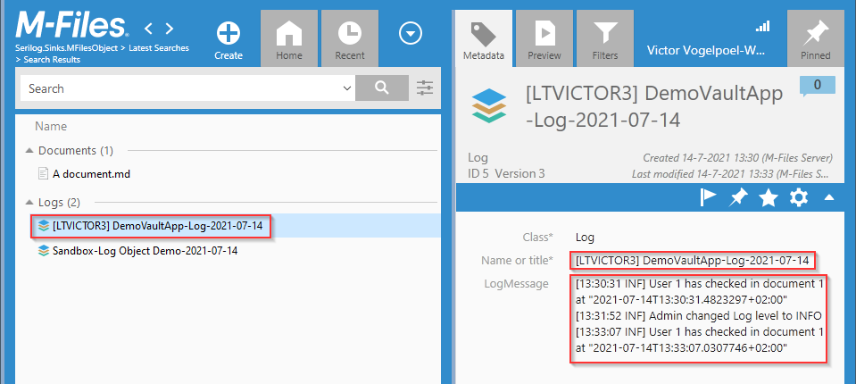

# Serilog.Sinks.MFilesObject

Serilog.Sinks.MFilesObject is a Serilog structured logging sink that emits LogEvents to a "rolling" Log object in an M-Files vault.

This is a **proof of concept** project by Victor Vogelpoel. See the disclaimer.

The solution contains two sinks, `Serilog.Sinks.MFilesObject` and `Serilog.Sinks.MFilesSysUtilsEventLog`, a sample sandbox console application, a sample vault application and a backup of its accompanying sample vault.

## Use Case

In a Vault Application, the only native logging is to the Windows Event log. Unfortunately, with a cloud vault, you'll have to request the event entries from M-Files CloudOps team.

This Serilog sink adds the necessary Log object type, class and property definition structure to the vault and emits LogEvents to a "rolling" Log object in the vault.
If the sink doesn't find a Log object with todays date in the name, it creates one and adds the log message. An subsequent log messages are appended to the object's LogMessage.
When the MultiLineText field limit of 10.000 characters is reached in a Log object, the remaining logmessage is added to a new Log object with a sequence number in its title.

To prevent a strain on the vault because of logging, any and all log messages are batched and appended after 5 seconds of collecting.

The default vault structure for logging is as follows and is created in the vault by the sink itself at startup:

- ObjectType `Log` - alias `OT.Serilog.MFilesObjectLogSink.Log`
- Class `Log` - alias `"CL.Serilog.MFilesObjectLogSink.Log"`
- Property Def `LogMessage` MultilineText - alias `PD.Serilog.MFilesObjectLogSink.LogMessage`

You can, however, use your own structure and aliases, as long as you configure this when creating the logger.


## DISCLAIMER

Serilog.Sinks.MFilesObject is distributed under Apache License, Version 2.0.

This program is distributed in the hope that it will be useful, but WITHOUT ANY WARRANTY; without even the implied warranty of MERCHANTABILITY or FITNESS FOR A PARTICULAR PURPOSE.

**WARRANTY**
THERE IS NO WARRANTY FOR THE PROGRAM, TO THE EXTENT PERMITTED BY APPLICABLE LAW. EXCEPT WHEN OTHERWISE STATED IN WRITING THE COPYRIGHT HOLDERS AND/OR OTHER PARTIES PROVIDE THE PROGRAM “AS IS” WITHOUT WARRANTY OF ANY KIND, EITHER EXPRESSED OR IMPLIED, INCLUDING, BUT NOT LIMITED TO, THE IMPLIED WARRANTIES OF MERCHANTABILITY AND FITNESS FOR A PARTICULAR PURPOSE. THE ENTIRE RISK AS TO THE QUALITY AND PERFORMANCE OF THE PROGRAM IS WITH YOU. SHOULD THE PROGRAM PROVE DEFECTIVE, YOU ASSUME THE COST OF ALL NECESSARY SERVICING, REPAIR OR CORRECTION.

**LIABILITY**
IN NO EVENT UNLESS REQUIRED BY APPLICABLE LAW OR AGREED TO IN WRITING WILL ANY COPYRIGHT HOLDER, OR ANY OTHER PARTY WHO MODIFIES AND/OR CONVEYS THE PROGRAM AS PERMITTED ABOVE, BE LIABLE TO YOU FOR DAMAGES, INCLUDING ANY GENERAL, SPECIAL, INCIDENTAL OR CONSEQUENTIAL DAMAGES ARISING OUT OF THE USE OR INABILITY TO USE THE PROGRAM (INCLUDING BUT NOT LIMITED TO LOSS OF DATA OR DATA BEING RENDERED INACCURATE OR LOSSES SUSTAINED BY YOU OR THIRD PARTIES OR A FAILURE OF THE PROGRAM TO OPERATE WITH ANY OTHER PROGRAMS), EVEN IF SUCH HOLDER OR OTHER PARTY HAS BEEN ADVISED OF THE POSSIBILITY OF SUCH DAMAGES.

Serilog.Sinks.MFilesObject is copyright 2021 Victor Vogelpoel - Provided under the [Apache License, Version 2.0](http://apache.org/licenses/LICENSE-2.0.html).

## Samples

You'll find the backup of a sample vault at `"src\DemoVault\Serilog.Sinks.MFilesObject-empty,no Log structure.mfb"`. This is no more than an new, empty vault. Restore this sample vault and use the sample vault application with this vault.
The `Serilog.Sinks.MFilesObject` sink will add the necessary logging structure to the vault at first run (if executed with administrative privileges).

This repository contains a sample Vault Application, called `DemoVaultApplication.sln` with appdef name `"Serilog.Sinks.MFilesObject Demo"` and logs any check-in of the "Document" class objects. Refresh the vault content in the M-Files Desktop App to find the Log objects with name `"VaultApp Serilog.Sinks.MFilesObject Demo-Log-yyyy-MM-dd"`.
In the M-Files Admin tool you can configure the logging level in the configuration of the vault application. Upon saving the configuration, the Serilog.Sinks.MFilesObject sink adheres to the logging level set.

Another sample is `SANDBOX` that logs on to the sample vault, ensures Log structure and logs some messages. Again, refresh the vault content in the M-Files Desktop App to find the Log objects with name `"LoggingFromSandboxDemo-Log-yyyy-MM-dd"`.

## Sample output

Logging in your application to this sink will create one or more Log objects in the vault. Its LogMessage property will look like below.

In this screenshot, you'll see several Log objects with a date in the title and several have a sequence number in the title, eg "`(3)`"



## Getting the samples to work

1. Import the sample vault `"src\DemoVault\Serilog.Sinks.MFilesObject-empty,no Log structure.mfb"` to your local M-Files server, naming it `"Serilog.Sinks.MFilesObject"` and preserving the Vault GUID; Grant access to M-files user accounts.
1. Add the vault connection credentials to the M-Files desktop desktop settings and open an M-Files Explorer.
1. Open the solution in Visual Studio, and build the `Debug` configuration (not `DebugWithoutDeployment`). Visual Studio will install the vault application into the vault. When installed correctly, the M-Files Admin will show the vault application `Serilog.Sinks.MFilesObject Demo` at `Configurations` > `Other Applications` and even have logged something already.
1. In the M-Files desktop app, add and check-in a document for class `Document`. The vault application will be triggered for event `BeforeCheckInChangesFinalize` and log the change. Refresh the desktop app to see the new or updated Log object.

The demo vault application has one configuration item where you can set set the minimal event level to log. If set to "None", nothing is logged. The sample vault application currenly only logs INFORMATIONAL events.

Note that the vault application also logs errors to the event log via the additionally configured log sink `Serilog.Sinks.MFilesSysUtilsEventLog`; this sink employs M-Files SysUtils.ReportToEventLog(). 
In the sample configuration, the MFilesSysUtilsEventLog is restricted to event level error, thus only error are emitted by the sink into the Windows event log.

## Vault Example code

A Vault Application CANNOT USE THE Serilog.Sinks.MFilesObject sink, unfortunately. We don't control the lifetime of vault that is referenced at logger construction. This will yield a "COM object that has been separated from its underlying RCW cannot be used." error, should the logger be used.
Instead of the Serilog.Sinks.MFilesObject sink, the example code shows using a DelegatingTextSink that drives an Action to buffer log messages. A background task is used in the vault application to flush these buffered messages every 5 seconds to an M-Files object. The PermanentVault is used as a vault reference.

```csharp
    /// <summary>
    /// Initialize the Vault Application, including logging structure in the vault.
    /// </summary>
    /// <param name="vault"></param>
    protected override void InitializeApplication(Vault vault)
    {
        base.InitializeApplication(vault);

        // Configure logging
        ConfigureApplication(vault);
    }

    /// <summary>
    /// Configure logging in the vault application, even create structure if necessary.
    /// </summary>
    /// <param name="vault"></param>
    public void ConfigureApplication(Vault vault)
    {
        // Configure logging
        // As this method is called from InitializeApplication, we can alter the vault structure, eg add ObjectType for Logging

        // Ensure that the structure for the logging-to-object is present in the vault, create if necessary.
        vault.EnsureLogSinkVaultStructure(_loggingStructureConfig);

        // ------------------------------------------------------------------------------------------------------------------------------------
        // Build a Serilog logger with MFilesObjectLogSink.
        // Note to Log.CloseAndFlush() in the UninitializeApplication()!
        Log.Logger = new LoggerConfiguration()
            .Enrich.FromLogContext()
            .MinimumLevel.ControlledBy(_loggingLevelSwitch)
            // Using a delegate to buffer log messages that are flushed later with a background job
            .WriteTo.DelegatingTextSink(w => WriteToVaultApplicationBuffer(w), outputTemplate:"[{Timestamp:HH:mm:ss} {Level:u3}] {Message:lj}{NewLine}{Exception}", levelSwitch:_loggingLevelSwitch)
            .WriteTo.MFilesSysUtilsEventLogSink(restrictedToMinimumLevel: LogEventLevel.Error)   // Only write errors to the EventLog.
            .CreateLogger();


        // UNFORTUNATELY, the MFilesObjectlogSink CANNOT be created in a VaultApplication like below; we don't control the vault lifecycle (as we do in the SANDBOX console application)
        // and it will invalidate soon after starting the vault application, yielding a "COM object that has been separated from its underlying RCW cannot be used."
        // when we should try and emit a LogEvent.
        // Hence using a DelegatingTextSink that collects the log messages and a background job that flushes the collected messages after 5 seconds.
        //
        //  .WriteTo.MFilesObject(vaultPersistent, mfilesLogObjectNamePrefix:     $"VaultApp-{ApplicationDefinition.Name}-Log-",
        //                                         mfilesLogObjectTypeAlias:      _loggingStructureConfig.LogObjectTypeAlias,
        //                                         mfilesLogClassAlias:           _loggingStructureConfig.LogClassAlias,
        //                                         mfilesLogMessagePropDefAlias:  _loggingStructureConfig.LogMessagePropDefAlias,
        //                                         controlLevelSwitch:            _loggingLevelSwitch)


        Log.Information("VaultApplication {ApplicationName} has configured logging to an M-Files rolling Log object.", ApplicationDefinition.Name);   // NOTE, structured logging with curly braces, NOT C# string intrapolation $"" with curly braces!

        Log.Error("Sample error");
    }

    private void WriteToVaultApplicationBuffer(string formattedLogMessage)
    {
        _logEventBuffer.AppendLine(formattedLogMessage.TrimEnd(new char[]{ '\r', '\n'}));

        // Note that the backgroundoperation will flush these messages to a Log object, as the PermanentVault is a valid reference.
    }


    protected override void StartApplication()
    {
        _flushLogAction = new Action(() =>
        {
            if (_logEventBuffer.Length > 0)
            {
                var batchedLogMessage = _logEventBuffer.ToString();
                _logEventBuffer.Clear();

                var controlledSwitch    = new ControlledLevelSwitch(_loggingLevelSwitch);
                var sink                = new MFilesObjectLogSink(this.PermanentVault, mfilesLogObjectNamePrefix: $"VaultApp-{ApplicationDefinition.Name}-Log-",
                                                                        mfilesLogObjectTypeAlias:      _loggingStructureConfig.LogObjectTypeAlias,
                                                                        mfilesLogClassAlias:           _loggingStructureConfig.LogClassAlias,
                                                                        mfilesLogMessagePropDefAlias:  _loggingStructureConfig.LogMessagePropDefAlias,
                                                                        controlledSwitch:               controlledSwitch,
                                                                        formatProvider:                 null);
                sink.EmitToMFilesLogObject(batchedLogMessage);
            }
        });

        this.BackgroundOperations.StartRecurringBackgroundOperation("Periodic Log-to-MFilesObject operation", TimeSpan.FromSeconds(5), _flushLogAction);

        base.StartApplication();
    }

    /// <summary>
    /// Power down the vault application. At least, flush the logging sinks.
    /// </summary>
    /// <param name="vault"></param>
    protected override void UninitializeApplication(Vault vault)
    {
        // IMPORTANT to flush any sink
        if (_flushLogAction != null) { _flushLogAction(); }
        Log.CloseAndFlush();

        base.UninitializeApplication(vault);
    }
```

## Sandbox Example code

The `Sandbox.csproj` project is simply a console application that logs on to the vault using MFAuthTypeLoggedOnWindowsUser, ensures vault structure for the logging, initializes the Serilog engine and logs some events. Make sure the current user has administrative vault access, because of creating vault structure.

```csharp
    var serverApp           = new MFilesAPI.MFilesServerApplication();
    serverApp.Connect(MFilesAPI.MFAuthType.MFAuthTypeLoggedOnWindowsUser);
    var vault               = serverApp.LogInAsUserToVault("{D449E438-89EE-42BB-9769-B862E9B1B140}");  // The "Serilog.Sinks.MFilesObject" demo vault


    // Add Vault structure for logging if it isn't there: OT "Log", CL "Log" and PD "LogMessage"
    var structureConfig = new MFilesObjectLogSinkVaultStructureConfiguration
    {
        LogObjectTypeNameSingular   = "Log",
        LogObjectTypeNamePlural     = "Logs",
        LogMessagePropDefName       = "LogMessage",

        LogObjectTypeAlias          = "OT.Serilog.MFilesObjectLogSink.Log",
        LogClassAlias               = "CL.Serilog.MFilesObjectLogSink.Log",
        LogMessagePropDefAlias      = "PD.Serilog.MFilesObjectLogSink.LogMessage"
    };

    // Ensure that the structure for Logging object and class is present in the vault
    vault.EnsureLogSinkVaultStructure(structureConfig);


    // -------------------------------------------------------------------------------------------------------
    // Now the fun starts!
    var loggingLevelSwitch = new LoggingLevelSwitch(LogEventLevel.Information);

    // Build a Serilog logger with MFilesObjectLogSink and Console
    Log.Logger = new LoggerConfiguration()
        .Enrich.FromLogContext()
        .MinimumLevel.ControlledBy(loggingLevelSwitch)
        .WriteTo.MFilesObject(vault, mfilesLogObjectNamePrefix:"LoggingFromSandboxDemo-Log-")       // Log to an 'rolling' object in the vault, eg objectType "Log" with a multiline text property.
        .WriteTo.Console()                                                                          // Write to the console with the same Log.xx statements to see them in the console terminal :-)
        .CreateLogger();


    // -----------------------------------------------------------------------------------------------------------------------------------------------------------------------
    // Now log messages
    // NOTE that these messages are BATCHED and stored in an new or existing M-Files object with the name "Log-yyyy-MM-dd" every 5 seconds.
    // Log messages do NOT appear immediately in the vault as a Log object, but are collected and pushed every 5 secs.
    Log.Information("This adds this log message to a Log object in the vault with the name \"DemoSandbox-Log-{Today}\"", DateTime.Today.ToString("yyyy-MM-dd"));

    Log.Information("This adds another info message to the {LogOT} object", structureConfig.LogObjectTypeNameSingular); // NOTE, structured logging, NOT C# string intrapolation!

    Log.Warning("And now a warning");

    Log.Error("And an ERROR!");

    // NOTE: in M-Files vault desktop application, explicitly search for Class = "Log"

    Thread.Sleep(6000);

    // IMPORTANT to flush out the batched messages to the vault, at the end of the application, otherwise messages within the last 5 seconds would not end up in the vault!
    Log.CloseAndFlush();
```

## Technical details

- The `Serilog.Sinks.MFilesObject` sink targets `.NET Framework 4.5`.
- The Demo vault application is built upon `M-Files Vault Application framework 2.2`.
- The `MFilesObject` sink implementation builds upon the `Serilog.Sinks.PeriodicBatching` to collect LogEvents before sending these off to the destination Log object in the vault. After installation, the vault will have an object type, class and property definition for logging.
- The demo vault application updates the logging level when saving the vault application configuration. The configured level is translated to LoggingLevelSwitch for the `Serilog.Sinks.MFilesObject` sink.


